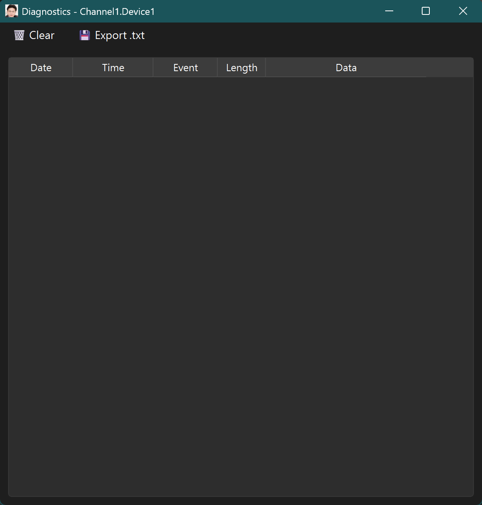

# ModUA - Modbus to OPC UA Bridge

**ModUA** 是一個專業的工業自動化橋接工具，將 Modbus 設備無縫整合至 OPC UA 生態系統。提供直觀的圖形化介面、實時數據監控、高效能通訊引擎，以及完整的診斷和配置管理功能。

**最新更新**: 2026年2月13日 - 新增自動啟動 Runtime、命令行參數支援、系統托盤功能

##  核心功能

##  Screenshots

以下為 UI 截圖（使用相對路徑從 images/ 讀取）：

（圖片已於 2026年2月3日更新）

###  工業通訊協議支援
- **Modbus TCP/RTU**: 完整支援 Modbus TCP、RTU over TCP 和串口 RTU
- **OPC UA 伺服器**: 完整實現的動態 OPC UA 伺服器，支援雙向讀寫操作和安全策略
- **多重功能碼**: 支援 coils、discrete inputs、input registers、holding registers
- **批量操作**: 優化批量讀寫操作，提升通訊效率

###  數據處理能力
- **多種數據類型**: Boolean、Integer、Float、Double、String、BCD 等
- **位元組順序處理**: 支援大端/小端字節順序和字組交換
- **地址映射**: 支援 0-based 和 1-based 地址模式
- **實時編碼**: 動態數據類型轉換和範圍驗證
- **虛擬滾動**: 支持數千標籤的高效能表格顯示

###  圖形化管理介面
- **專案樹狀結構**: Channel  Device  Group  Tag 的層次管理
- **即時監控**: 實時數據表格顯示和狀態指示，支持數千標籤
- **拖拽操作**: 支援拖拽複製和移動標籤
- **配置對話框**: 直觀的參數配置介面和統一的對話框樣式
- **虛擬滾動**: 高效能表格模型，避免大量標籤時的性能問題

###  監控與診斷
- **實時數據監控**: 連續輪詢和狀態追蹤
- **診斷工具**: 增強的診斷終端，主要記錄 Modbus ADU 的傳輸和接收訊息
- **性能監控**: 通訊統計和延遲分析
- **日誌系統**: 詳細的操作日誌和錯誤記錄
- **線程安全**: 診斷系統的線程安全設計

##  新功能 (2026年2月13日更新)

### 自動啟動 Runtime
- 在 Runtime 燈號右側提供核取方塊來控制自動啟動功能
- 勾選核取方塊後，下次啟動應用程式時會自動開始 Modbus 輪詢
- 設定會保存到 %APPDATA%\ModUA\settings.json 文件中
- 核取方塊狀態直觀顯示目前的設定

### 命令行參數支援
打包後的 exe 文件支援以下命令行參數：

`ash
# 自動啟動 runtime
ModUA.exe --start-runtime

# 加載指定項目文件
ModUA.exe --load-project "path/to/project.json"

# 以最小化狀態啟動
ModUA.exe --minimized

# 組合使用
ModUA.exe --start-runtime --load-project "path/to/project.json" --minimized

# 查看幫助
ModUA.exe --help

# 查看版本
ModUA.exe --version
`

### 系統托盤支援
- 應用程式支援最小化到系統托盤
- 雙擊托盤圖標可恢復窗口顯示
- 右鍵托盤圖標顯示操作選單：
  - **顯示窗口**：恢復主窗口
  - **退出**：完全關閉應用程式
- 最小化時顯示通知訊息

### 應用程式設定管理
- 應用程式級別設定與專案設定分離
- 設定文件位置：%APPDATA%\ModUA\settings.json
- 支援設定持久化，重啟後保持用戶偏好

##  快速開始

### 環境需求
- **Python**: 3.12 或更新版本
- **作業系統**: Windows 10/11
- **記憶體**: 至少 2GB RAM
- **網路**: 支援 TCP/IP 和串口通訊

### 安裝步驟

1. **複製專案**
`ash
git clone https://github.com/lioil1020-JackLee/ModUA.git
cd ModUA
`

2. **建立虛擬環境**
`ash
python -m venv .venv
# Windows
.venv\Scripts\activate
# Linux/macOS
source .venv/bin/activate
`

3. **安裝依賴**
`ash
pip install -r requirements.txt
`

4. **啟動應用程式**
`ash
python ModUA.py
`

##  專案結構

`
ModUA/
 ModUA.py                 # 主應用程式入口 (5148 行)
 core/                    # 核心業務邏輯
    controllers/         # 控制器層
       base_controller.py    # 主控制器
       config_builder.py     # 配置建構器
       data_manager.py       # 數據管理器
       serializers.py        # 序列化器
       validators.py         # 數據驗證器
    modbus/              # Modbus 通訊模塊
       modbus_client.py      # Modbus 客戶端
       modbus_worker.py      # 輪詢工作器
       modbus_mapping.py     # 地址映射
       modbus_monitor.py     # 通訊監控
       modbus_scheduler.py   # 調度器
       modbus_write_queue.py # 寫入隊列
       data_buffer.py        # 數據緩衝區
    OPC_UA/               # OPC UA 模塊
       opcua_server.py      # OPC UA 伺服器
    diagnostics.py        # 診斷管理器
    ui_models.py          # UI 數據模型
    config/               # 配置模塊
       constants.py          # 常量定義
       __init__.py
    utils/                # 工具模塊
       network_utils.py     # 網路工具
       validation_utils.py  # 驗證工具
       __init__.py
    __init__.py
 ui/                      # 用戶介面模塊
    base_dialogs.py      # 基礎對話框
    clipboard.py         # 剪貼板管理
    components.py        # UI 組件
    dragdrop_tree.py     # 拖拽樹狀控件
    terminal_window.py   # 終端機窗口
    dialogs/             # 對話框模塊
       channel_dialog.py    # 通道對話框
       device_dialog.py     # 設備對話框
       group_dialog.py      # 群組對話框
       opcua_dialog.py      # OPC UA 對話框
       tag_dialog.py        # 標籤對話框
       write_value_dialog.py # 寫入值對話框
       __init__.py
    __init__.py
 images/                  # 圖片資源
 certs/                   # 證書文件
 build/                   # 打包輸出目錄
 dist/                    # 最終分發文件
 pyproject.toml           # 專案配置
 requirements.txt         # Python 依賴
 README.md                # 專案說明
 LICENSE                  # 授權文件
 ModUA-onedir.spec        # PyInstaller onedir 配置
 ModUA-onefile.spec       # PyInstaller onefile 配置
 uv.lock                  # uv 依賴鎖定文件
`

##  開發與打包

### 開發環境設置
`ash
# 安裝 uv (如果尚未安裝)
pip install uv

# 同步依賴
uv sync

# 運行開發版本
uv run python ModUA.py
`

### 打包應用程式
`ash
# 安裝打包依賴
uv sync --dev

# 打包 onedir 版本
uv run pyinstaller --clean ModUA-onedir.spec

# 打包 onefile 版本
uv run pyinstaller --clean ModUA-onefile.spec
`

### 測試打包結果
`ash
# 測試命令行參數
./dist/ModUA-onefile.exe --help
./dist/ModUA-onefile.exe --version
./dist/ModUA-onefile.exe --start-runtime
`

##  貢獻指南

歡迎提交 Issue 和 Pull Request！

### 開發規範
- 使用 uv 進行依賴管理
- 遵循 PEP 8 編碼規範
- 添加適當的類型提示
- 為新功能編寫單元測試

### 提交規範
- 使用清晰的提交訊息
- 為重大功能更新版本號
- 更新相關文檔

##  授權

本專案採用 MIT 授權 - 詳見 [LICENSE](LICENSE) 文件

##  聯絡方式

如有問題或建議，請通過 GitHub Issues 聯絡我們。
