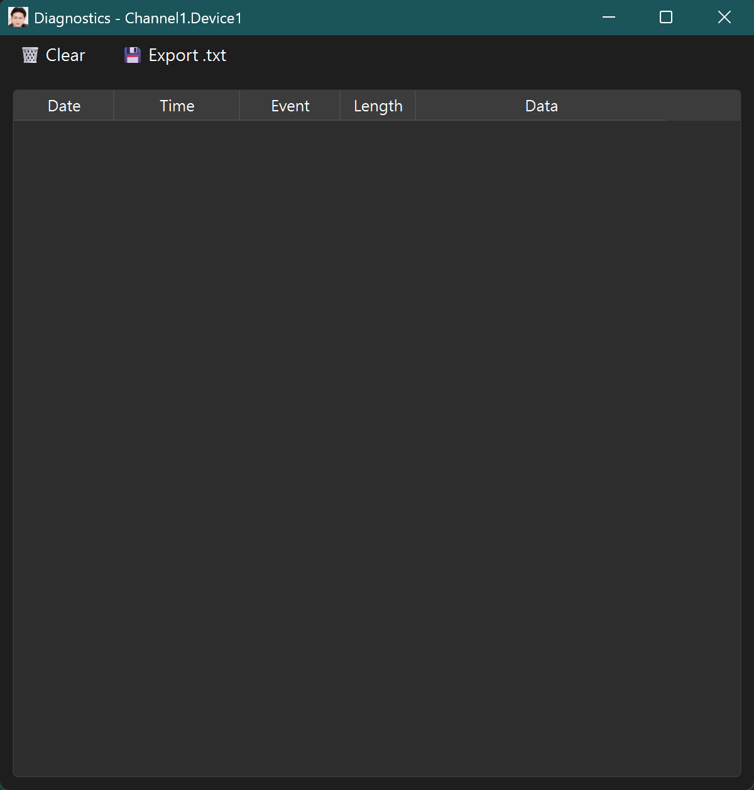

# ModUA - Modbus to OPC UA Bridge

[](https://www.python.org/)
[](https://pypi.org/project/PyQt6/)
[](LICENSE)

ModUA is a PyQt6 desktop application that bridges Modbus devices into an OPC UA environment. It combines a graphical configuration UI, a Modbus polling engine, an OPC UA server, diagnostics tooling, and project/runtime management in a single app.

This repository is now managed entirely with `uv`.

- Python dependencies are defined only in `pyproject.toml`
- The lockfile is `uv.lock`
- Running, syncing, and packaging all go through `uv`
- `requirements.txt` is no longer used

## Project Analysis

The current project structure is application-oriented rather than library-oriented:

- `ModUA.py`: main desktop entry point, CLI parsing, Qt startup, window lifecycle
- `core/`: business logic, Modbus communication, OPC UA server, controllers, diagnostics, shared models
- `ui/`: PyQt6 widgets, dialogs, tree view behavior, terminal window
- `images/`, `certs/`, `*.spec`: application assets, certificates, and PyInstaller packaging config

Architecturally, this is a single-entry desktop application with clear separation between UI and protocol/runtime logic. That makes `uv sync`, `uv lock`, and `uv run` a good fit for keeping environments reproducible without maintaining parallel dependency files.

## Features

- Modbus TCP, RTU over TCP, and serial RTU support
- Built-in OPC UA server with runtime configuration
- Channel / Device / Group / Tag hierarchical management
- Multiple data type, byte order, and address mapping options
- Diagnostics window for Modbus ADU traffic and runtime behavior
- Auto-start runtime, command-line arguments, and system tray support

## Screenshots




## Requirements

- Python 3.12+
- `uv`
- Windows 10/11

## Quick Start

### Clone the repository

```bash
git clone https://github.com/lioil1020-JackLee/ModUA.git
cd ModUA
```

### Check `uv`

```bash
uv --version
```

### Sync dependencies

```bash
uv sync
```

This creates or updates `.venv` from `pyproject.toml` and `uv.lock`. You do not need `python -m venv` or `pip install -r ...`.

### Run the app

```bash
uv run ModUA.py
```

### Common commands

```bash
uv run ModUA.py --start-runtime
uv run ModUA.py --load-project "1_serial.json"
uv run ModUA.py --load-project "1_serial.json" --start-runtime
uv run ModUA.py --minimized
uv run ModUA.py --help
uv run ModUA.py --version
```

## Development

### Sync development tools

```bash
uv sync --group dev
```

### Package with PyInstaller

```bash
uv run pyinstaller --clean ModUA-onedir.spec
uv run pyinstaller --clean ModUA-onefile.spec
```

### Test packaged output

```bash
.\dist\ModUA-onefile.exe --help
.\dist\ModUA-onefile.exe --version
.\dist\ModUA-onefile.exe --start-runtime
```

## Project Layout

```text
ModUA/
|-- ModUA.py
|-- pyproject.toml
|-- uv.lock
|-- README.md
|-- ModUA-onedir.spec
|-- ModUA-onefile.spec
|-- core/
|   |-- controllers/
|   |-- modbus/
|   |-- OPC_UA/
|   |-- config/
|   `-- utils/
|-- ui/
|   |-- dialogs/
|   `-- ...
|-- images/
`-- certs/
```

## uv Workflow

- Add a dependency: `uv add <package>`
- Remove a dependency: `uv remove <package>`
- Refresh the lockfile: `uv lock`
- Sync the environment: `uv sync`
- Run the app or tools: `uv run ...`

## License

This project is licensed under the [MIT License](LICENSE).
